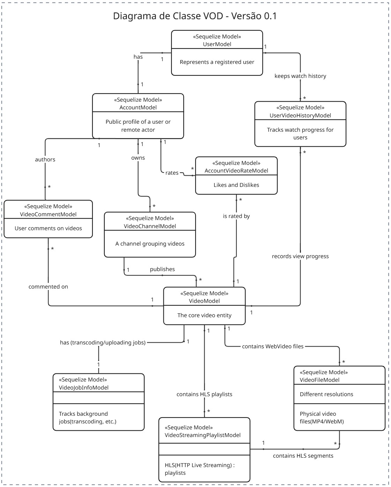
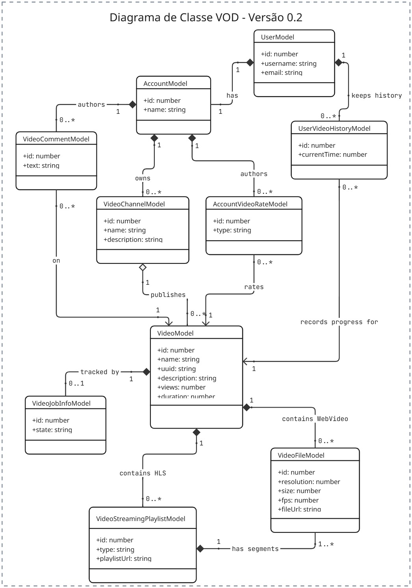
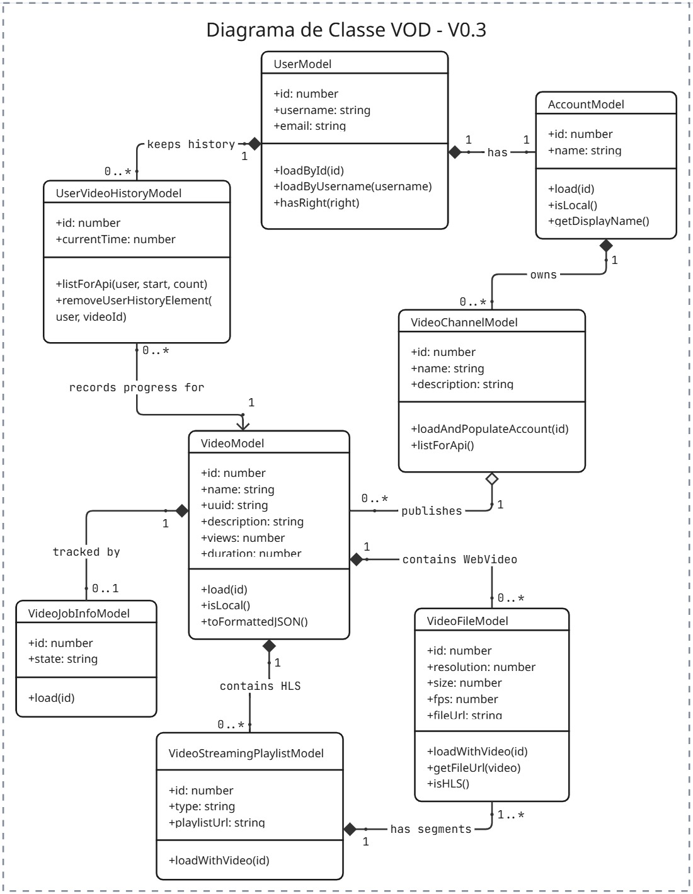
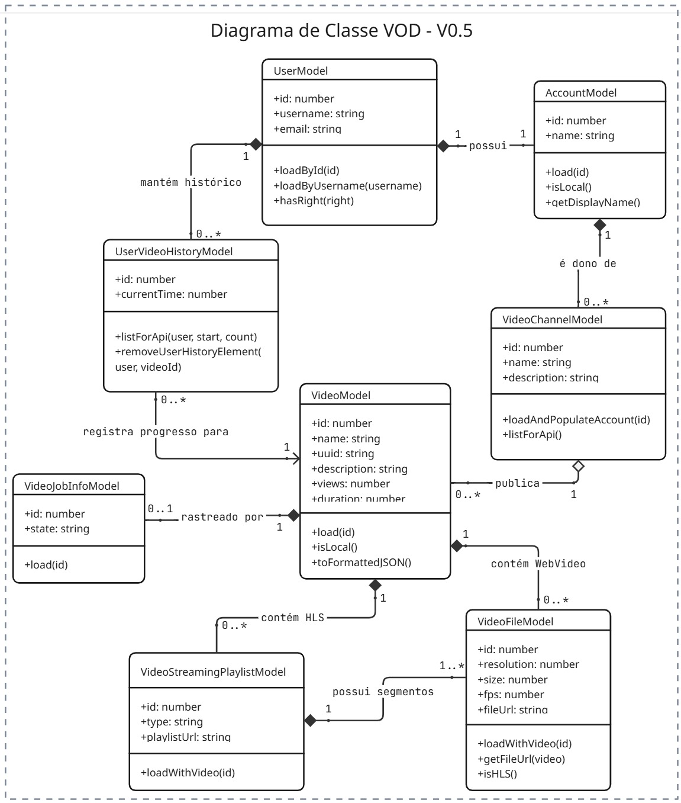
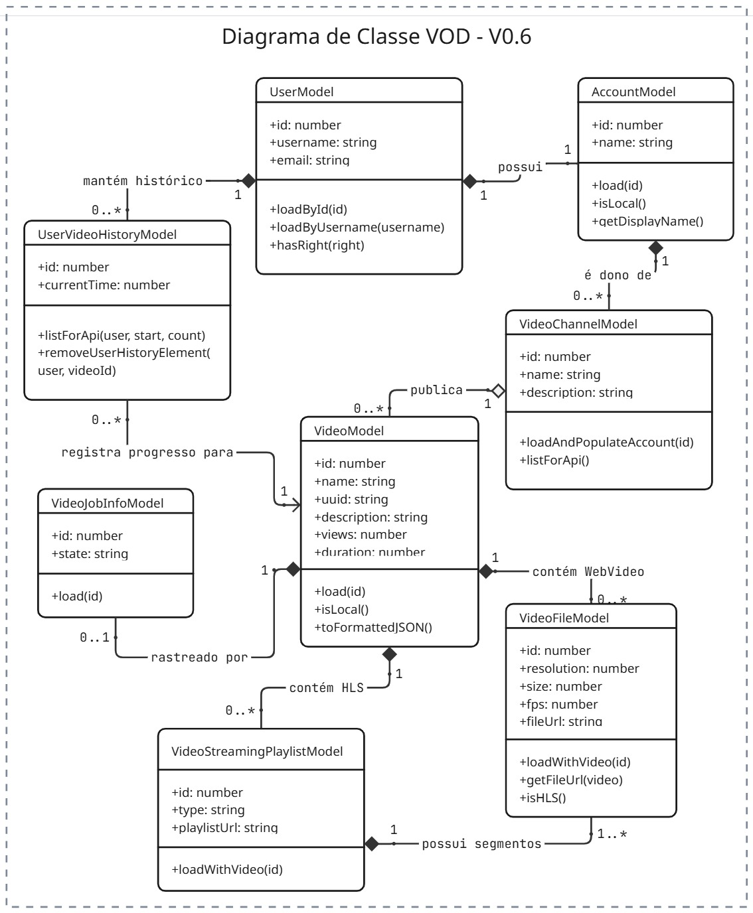

# SubEquipe_03 — FOCO_01: Modelagem Estática

Nossa SubEquipe desenvolveu um Diagrama de Classe seguindo o fluxo relacionado às funcionalidades de *video on demand ou VOD*, isto é, vídeos publicados pelos usuários que podem ser assistidos a qualquer momento.

## Participantes no Foco_01
| Nome do membro | Participação registrada |
|---|---|
| [Giovana Barbosa](https://github.com/gio221) | Elaboração inicial do Diagrama de Classe |
| [José Augusto](https://github.com/JaugustoM) | Elaboração inicial do Diagrama de Classe com auxílio de IA |
| [Pedro Lucas](https://github.com/pwdrinho) | Elaboração final do diagrama de classe |

## Metodologia do Foco_01

### Metodologia de Desenvolvimento do Diagrama de Classes

A elaboração do diagrama de classes para o sistema de *Video on Demand* (VOD) foi conduzida de forma colaborativa pelos integrantes da subequipe,
utilizando uma metodologia estruturada em reuniões de alinhamento técnico, análise iterativa de domínio e aplicação dos padrões formais da [**Unified Modeling Language (UML)**](#ref1), integrando conceitos formais de modelagem orientada a objetos [LES/PUC-Rio](#ref5). Como insumo principal para a definição dos requisitos arquiteturais, rotas de interface e mapeamento do domínio de streaming, foi utilizado os relatórios e achados das pesquisas de engenharia reversa desenvolvidas tanto pela nossa equipe quanto pela [SubEquipe 02](#ref2), fundamentadas no estudo detalhado da plataforma PeerTube.

A partir das estruturas, serviços e fluxos mapeados na engenharia reversa, fez-se uso de Inteligência [Artificial Generativa](#ref6) para elaborar as primeiras versões e rascunhos do diagrama de classes. O uso da IA acelerou a prototipagem inicial e a identificação preliminar das entidades do sistema. Em seguida, o grupo realizou sessões iterativas de revisão técnica e refinamento manual sobre os esboços gerados por IA, ajustando visibilidades, validando associações e adequando o modelo às boas práticas formais da [especificação UML](#ref3) utilizando como ferramenta de diagramação um template de [Ken Ritley no Miro](#ref4).

O processo de refinamento e estruturação seguiu etapas bem definidas de análise e modelagem orientada a objetos [[DevMedia](#ref1)]:

1. **Abstração e Delimitação do Escopo**: Aplicou-se o princípio da abstração para focar nos aspectos essenciais do domínio VOD, considerando também elementos relevantes e objetos tangíveis indispensáveis à aplicação do diagrama sobre a proposta do projeto [[UML Class Diagrams](#ref3)].

2. **Agrupamento e Eliminação de Redundâncias**: Para evitar duplicidades conceituais e a criação desnecessária de tabelas no banco de dados [[DevMedia](#ref1)], os objetos foram agrupados por características semelhantes. Em seguida, eliminaram-se redundâncias, consolidando as classes fundamentais: `Usuario`, `Perfil`, `Assinatura`, `Catalogo`, `Midia` e `SessaoDeReproducao` [[DevMedia](#ref1)].

3. **Definição da Estrutura Interna e Visibilidade**: As classes foram formalizadas na notação UML em retângulos divididos em três seções (Nome, Atributos e Métodos). Adotou-se o padrão de nomenclatura no singular com inicial maiúscula [[LES/PUC-Rio](#ref5)], especificando os níveis formais de visibilidade: público (`+`), protegido (`#`) e privado (`-`) [[DevMedia](#ref1)][[LES/PUC-Rio](#ref5)].

4. **Modelagem de Relacionamentos, Multiplicidades e Regras**: Estabeleceram-se as conexões lógicas, sentidos de navegação e indicadores de multiplicidade (como `1`, `0..*`, `1..*`) [[LES/PUC-Rio](#ref5)]. Aplicou-se **Generalização** para a superclasse abstrata `Midia` e suas subclasses `Filme` e `Serie` [[LES/PUC-Rio](#ref5)]; **Composição** forte entre `Serie`, `Temporada` e `Episodio`, dado que um episódio possui ciclo de vida dependente da sua temporada e série [[LES/PUC-Rio](#ref5)]; e a classe mediadora `SessaoDeReproducao` para conectar `Perfil` e `Midia`, armazenando o estado dinâmico da exibição VOD (como `timestampParada` e `qualidadeDeVideo`) [[DevMedia](#ref1)] [[UML Class Diagrams](#ref3)].

## Modelo Estático - Diagrama de Classe

O diagrama de classe foi escolhido porque ...

A seguir é possivel visualizar a versão mais atualizada até o momento, em sequência o histórico de versões feitas pela equipe até chegar na versão atual.

### Versão Atual

*Figura X — Diagrama de Classe VOD v.0X. Autoria: [Giovana Barbosa](https://github.com/gio221), [José Augusto](https://github.com/JaugustoM) e [Pedro Lucas](https://github.com/pwdrinho) .*

### Históricos de Versões

Com o objetivo de documentar e evidenciar a evolução do processo de desenvolvimento, foi elaborado um histórico das versões do diagrama de classes. Cada versão é acompanhada de uma breve descrição das principais alterações realizadas, uma imagem representativa do diagrama e um link para o código-fonte correspondente. Esse código contém um detalhamento mais aprofundado das modificações de cada versão. Para evitar o excesso de informações na página principal, a subequipe optou por manter esse detalhamento diretamente nos respectivos arquivos de código.

<b>Ver Versão 0.1</b>

### Diagrama de Classe V0.1

Nessa primeira versão, podemos observar que o diagrama de classe ainda não está suficientemente elaborado e apresenta algumas inconsistências em relação às notações e aos princípios da UML. Embora a estrutura faça sentido quando analisamos isoladamente os elementos identificados durante a pesquisa sobre o PeerTube, ela ainda não representa de forma adequada um diagrama de classes completo. É necessário aprimorar a identificação e a organização das classes, seus atributos, métodos e relacionamentos, de modo que o diagrama esteja mais alinhado aos requisitos levantados.

*Figura 1 — Diagrama de Classe VOD v.0.1. Autoria: [José Augusto](https://github.com/JaugustoM).*

[Ver código referente ao diagrama Versão 0.1](./../../../assets/SubGrupo03/DiagramaDeClasse/vod_class_diagram1.md)

<b>Ver Versão 0.2</b>

### Diagrama de Classe V0.2

Nessa segunda versão, já é possível perceber uma evolução significativa em relação à V0.1. O diagrama passa a apresentar uma estrutura mais próxima das notações da UML, com as classes contendo atributos públicos e espaços destinados à definição dos métodos, ainda que vazios nesta etapa. Também foram introduzidos diferentes tipos de relacionamentos entre as classes, como agregação e composição, além da representação das multiplicidades.

*Figura 2 — Diagrama de Classe VOD v.0.2. Autoria: [José Augusto](https://github.com/JaugustoM).*

[Ver código referente ao diagrama Versão 0.2](./../../../assets/SubGrupo03/DiagramaDeClasse/vod_class_diagram2.md)

<b>Ver Versão 0.3</b>

### Diagrama de Classe V0.3

Nessa terceira versão, o principal ponto de evolução em relação à V0.2 é a inserção dos métodos públicos nas classes. Com isso, o diagrama passa a representar não apenas os atributos e a estrutura das classes, mas também parte de seus comportamentos e responsabilidades.

*Figura 3 — Diagrama de Classe VOD v.0.3. Autoria: [José Augusto](https://github.com/JaugustoM).*

[Ver código referente ao diagrama Versão 0.3](./../../../assets/SubGrupo03/DiagramaDeClasse/vod_class_diagram3.md)

<b>Ver Versão 0.4</b>

### Diagrama de Classe V0.4

*Figura 4 — Diagrama de Classe VOD v.04. Autoria: [Giovana Barbosa](https://github.com/gio221), [José Augusto](https://github.com/JaugustoM) e [Pedro Lucas](https://github.com/pwdrinho) .*

[Ver código referente ao diagrama Versão 0.4](./../../../assets/SubGrupo03/DiagramaDeClasse/vod_class_diagram5.md)

<b>Ver Versão 0.5</b>

### Diagrama de Classe V0.5

*Figura 6 — Diagrama de Classe VOD v.05. Autoria: [Giovana Barbosa](https://github.com/gio221), [José Augusto](https://github.com/JaugustoM) e [Pedro Lucas](https://github.com/pwdrinho) .*

[Ver código referente ao diagrama Versão 0.5](./../../../assets/SubGrupo03/DiagramaDeClasse/vod_class_diagram6.md)

---

## Referências

DEVMEDIA. *Orientações básicas na elaboração de um diagrama de classes*. [DevMedia – Orientações Básicas em Diagrama de Classes](https://www.devmedia.com.br/orientacoes-basicas-na-elaboracao-de-um-diagrama-de-classes/37224). Acesso em: 15 set. 2026.

UNIVERSIDADE DE BRASÍLIA. *Engenharia reversa: Projeto Streaming Video — PeerTube*. GitHub Pages. [Relatório de Engenharia Reversa – Projeto Streaming Video](https://unbarqdsw2026-2-turma02.github.io/2026.2_T02_G3_ProjetoStreamingVideo_Entrega_01/#/Base/Relatórios/1.2.SubEquipe_02/Engenharia_reversa). Acesso em: 16 set. 2026.

UML-DIAGRAMS.ORG. *UML class and object diagrams overview*. [UML Class and Object Diagrams Overview](https://www.uml-diagrams.org/class-diagrams-overview.html). Acesso em: 15 set. 2026.

MIRO. *Modelo de diagrama de classes UML*. Modelo de Ken Ritley. [Miro – Modelo de Diagrama de Classes UML](https://miro.com/pt/modelos/uml-diagram-ken-ritley/). Acesso em: 15 set. 2026.

LES/PUC-RIO; UNIVERSIDADE ESTADUAL PAULISTA. *UML: diagrama de classes*. [Moodle UNESP – Diagrama de Classes (PDF)](https://moodle.unesp.br/pluginfile.php/25933/mod_resource/content/1/diagrama_classes.pdf). Acesso em: 16 set. 2026.

*Prompt Gemini: [Elaboração Diagrama de Classe](../../../assets/SubGrupo03/DiagramaDeClasse/gemini.md)*. Prompt elaborado com auxílio do Google Gemini. Documento não publicado. Brasília, 2026.

## Histórico de Versões

| Versão | Data | Descrição | Autor | Revisores |
| --- | --- | --- | --- | --- |
| 1.0 | 15/09/2026 | Adiciona Diagramas de Classes iniciais | [Pedro Lucas](https://github.com/pwdrinho) e [José Augusto](https://github.com/JaugustoM) | - |
| 1.1 | 16/09/2026 | Adiciona Metodologia e Referências | [Pedro Lucas](https://github.com/pwdrinho) | - |
| 1.2 | 16/09/2026 | Adiciona Histórico de versões do diagrama de classe | [Pedro Lucas](https://github.com/pwdrinho) e [José Augusto](https://github.com/JaugustoM) | - |
