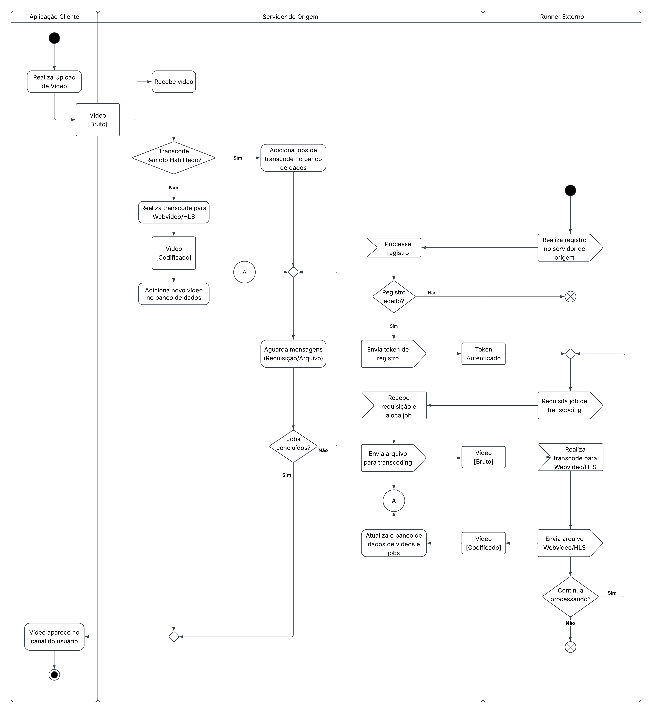
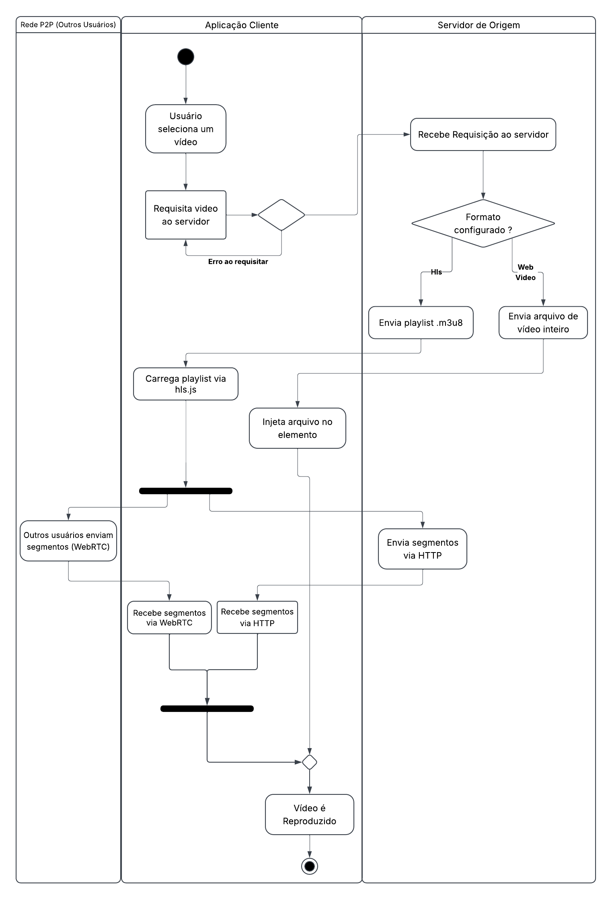
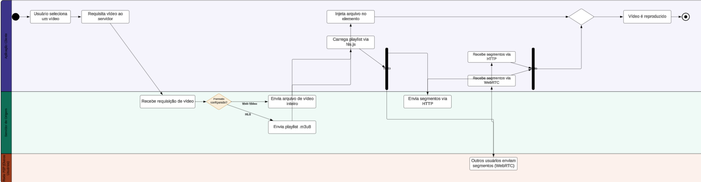

# SubEquipe_03 — FOCO_02: Modelagem Dinâmica

Entrega Mínima: um modelo dinâmico, na notação UML.
Mira-se no MM no FOCO, com a entrega mínima.

## Participantes no Foco_02
| Nome do membro                               | Participação registrada                                                       |
| -------------------------------------------- | ----------------------------------------------------------------------------- |
| [Giovana Barbosa](https://github.com/gio221) | Elaboração do diagrama de atividades relacionada ao fluxo de dowload de vídeo |
| [José Augusto](https://github.com/JaugustoM) | Elaboração do diagrama de atividades relacionada ao fluxo de upload de vídeos |
| [Pedro Lucas](https://github.com/pwdrinho)   | Elaboração e revisão dos diagramas de atividades |

## Metodologia do Foco_02

A elaboração dos diagramas de atividades para o módulo de *Video on Demand* (VOD) foi conduzida de forma colaborativa pelos integrantes da subequipe, realizando reuniões síncronas de alinhamento, análise documental e aplicação dos padrões da [*Unified Modelling Language* (UML)](#ref1). O principal insumo para a elaboração desses diagramas foi a pesquisa feita por esta subequipe para a criação do BPMN na [Entrega 1](#ref6), que foi feita com base na [documentação de arquitetura do PeerTube](#ref5).

A partir dos diagramas e da pesquisa produzidos na Entrega 1, foi feito um trabalho de tradução do fluxo observado na aplicação para um diagrama de atividades que seguisse a notação UML, apoiada na [documentação](#ref2) e [exemplos](#ref4) feitos por Fakhroutdinov, utilizando o Lucidchart como ferramenta de desenho. Paralelo a todo este processo foram utilizadas ferramentas de IA para auxiliar na ideação e revisão dos diagramas, acelerando o desenvolvimento iterativo incremental destes diagramas.

A criação destes diagramas passou pelas seguintes etapas:

1. **Tradução Direta**: Nesta etapa foi feito um trabalho de tradução básica do fluxo de atividades representado no diagrama BPMN da Entrega 1, focando em finalizar um modelo básico sem focar no uso de abstrações complexas da UML.

2. **Refinamento**: Nesta etapa foram feitos melhorias e correções nos modelos produzidos anteriormente, se baseando em [exemplos](#ref4) mais complexos de diagramas de atividades para refinar os diagramas. Este processo tanto de forma individual como em grupo e teve o auxilio de [ferramentas de IA](#ref7).

## Modelo Dinâmico

A seguir está o diagrama de atividades que representa o fluxo de upload de vídeos para o PeerTube.

*Figura 1 — Diagrama de Atividades de Upload de Vídeos v.1. Autoria: [Giovana Barbosa](https://github.com/gio221), [José Augusto](https://github.com/JaugustoM) e [Pedro Lucas](https://github.com/pwdrinho).*

A seguir também está o diagrama de atividade que representa o fluxo de dowload de vídeos para o PeerTube

*Figura 2 — Diagrama de Atividades de Dowload de Vídeos v.2. Autoria: [Giovana Barbosa](https://github.com/gio221), [José Augusto](https://github.com/JaugustoM) e [Pedro Lucas](https://github.com/pwdrinho).*

<b>Ver Versão 1 Diagrama de Atividades de Dowload de Vídeos</b>

*Figura 3 — Diagrama de Classe VOD v.1. Autoria: [Giovana Barbosa](https://github.com/gio221), [José Augusto](https://github.com/JaugustoM) e [Pedro Lucas](https://github.com/pwdrinho).*

## Referências

Fakhroutdinov, Kirill. *The Unified Modeling Language*. Disponível em: <https://www.uml-diagrams.org>. Acesso em: 16 set. 2026.

Fakhroutdinov, Kirill. *Activity Diagrams*. Disponível em: <https://www.uml-diagrams.org/activity-diagrams.html>. Acesso em: 16 set. 2026.

Fakhroutdinov, Kirill. *UML Activity Diagrams Reference*. Disponível em: <https://www.uml-diagrams.org/activity-diagrams-reference.html>. Acesso em: 16 set. 2026.

Fakhroutdinov, Kirill. *UML Activity Diagram Examples*. Disponível em: <https://www.uml-diagrams.org/activity-diagrams-examples.html>. Acesso em: 16 set. 2026.

PeerTube. *Architecture*. Disponível em: <https://docs.joinpeertube.org/contribute/architecture>. Acesso em: 16 set. 2026.

Subequipe 3. *Entrega 1*. Disponível em: <https://unbarqdsw2026-2-turma02.github.io/2026.2_T02_G3_ProjetoStreamingVideo_Entrega_01/#/Base/Relat%C3%B3rios/1.1.3.SubEquipe_03/1.1.3.SubEquipe_03>. Acesso em: 16 set. 2026.

Gemini. *Conversa com o Gemini*. Disponível em: <https://share.gemini.google/qiMxVoJkWTS1>. Acesso em: 16 set. 2026.

## Histórico de Versões

| Versão | Data | Descrição | Autor | Revisores |
| :----: | :--: | :-------- | :---- | :-------- |
| 1.0 | 16/09/2026 | Adiciona primeiro diagrama de atividades e a metodologia utilizada | [José Augusto](https://github.com/JaugustoM) | [Giovana Barbosa](https://github.com/gio221)        |
| 1.1 | 16/09/2026 | Adiciona segundo diagrama de atividades da parte de dowload | [Giovana Barbosa](https://github.com/gio221) | [Pedro Lucas](https://github.com/pwdrinho) |
| 1.2 | 17/09/2026 | Adiciona segunda versão do diagrama de atividade | [Pedro Lucas](https://github.com/pwdrinho) | [José Augusto](https://github.com/JaugustoM) |