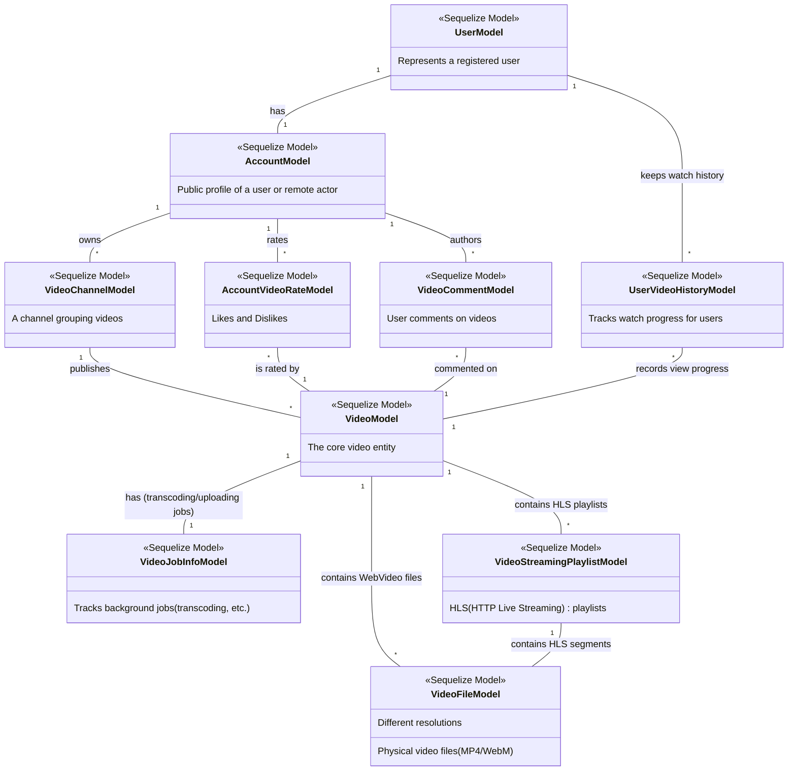

# PeerTube VOD Architecture

Based on the reverse engineering of the `server/core/models` directory, here is a Mermaid class diagram focusing on the entities involved in **Video on Demand (VOD) uploading and watching** processes.

## Key Workflows

### Video Uploading
1. A **User** (authenticated via `UserModel`) selects a **VideoChannel** (owned by their `AccountModel`).
2. A new **VideoModel** is created.
3. Background processing is tracked via **VideoJobInfoModel**.
4. The server creates either direct **VideoFileModel** entries (for standard WebVideo files) or processes the video into HLS streams, creating a **VideoStreamingPlaylistModel** which in turn contains multiple **VideoFileModel** fragments at different resolutions.

### Video Watching
1. The client requests the video and fetches either the `VideoFile` or the `VideoStreamingPlaylist`.
2. As the user watches, progress is recorded in **UserVideoHistoryModel**.
3. The user can interact with the video by liking/disliking (**AccountVideoRateModel**) or leaving comments (**VideoCommentModel**), which are tied back to their **AccountModel**.
