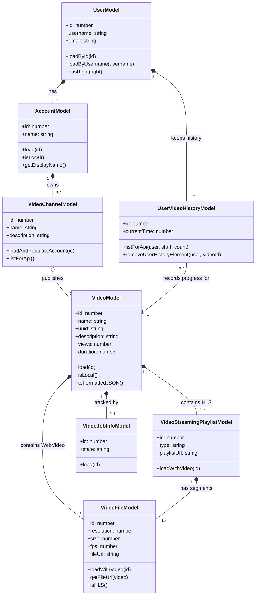

# PeerTube VOD Architecture

Based on the reverse engineering of the `server/core/models` directory, here is a Mermaid class diagram focusing on the entities involved in **Video on Demand (VOD) uploading and watching** processes.

## Key Workflows

### Video Uploading
1. A **User** (authenticated via `UserModel`) selects a **VideoChannel** (owned by their `AccountModel`).
2. A new **VideoModel** is created.
3. Background processing is tracked via **VideoJobInfoModel**.
4. The server creates either direct **VideoFileModel** entries (for standard WebVideo files) or processes the video into HLS streams, creating a **VideoStreamingPlaylistModel** which in turn contains multiple **VideoFileModel** fragments at different resolutions.

### Video Watching
1. The client requests the video and fetches either the `VideoFile` or the `VideoStreamingPlaylist`.
2. As the user watches, progress is recorded in **UserVideoHistoryModel**.

## Class Descriptions

### `UserModel`
| Member | Type | Description |
|---|---|---|
| `+id` | Attribute | The unique numeric identifier for the user in the database. |
| `+username` | Attribute | The unique username used for local authentication and identification. |
| `+email` | Attribute | The user's registered email address. |
| `+loadById(id)` | Method | Retrieves a user entity from the database by its primary key ID. |
| `+loadByUsername(username)` | Method | Retrieves a user entity matching the provided username string. |
| `+hasRight(right)` | Method | Checks if the user possesses a specific permission right (e.g., admin privileges). |

### `AccountModel`
| Member | Type | Description |
|---|---|---|
| `+id` | Attribute | The unique numeric identifier for the account. |
| `+name` | Attribute | The public-facing name of the account, often matching the username or a federated handle. |
| `+load(id)` | Method | Retrieves the account by its primary key. |
| `+isLocal()` | Method | Determines if the account belongs to a user on the local instance vs a remote federated instance. |
| `+getDisplayName()` | Method | Returns a formatted display name for the account used in the UI. |

### `VideoChannelModel`
| Member | Type | Description |
|---|---|---|
| `+id` | Attribute | The unique numeric identifier for the channel. |
| `+name` | Attribute | The unique identifier name of the channel. |
| `+description` | Attribute | A text description providing details about the channel. |
| `+loadAndPopulateAccount(id)` | Method | Loads the channel and performs a SQL join to populate its owning `AccountModel`. |
| `+listForApi()` | Method | Retrieves a paginated list of channels formatted for API responses. |

### `VideoModel`
| Member | Type | Description |
|---|---|---|
| `+id` | Attribute | The unique numeric identifier for the video. |
| `+name` | Attribute | The title of the video. |
| `+uuid` | Attribute | A universally unique identifier used for public URLs to avoid exposing sequential IDs. |
| `+description` | Attribute | The detailed description text of the video. |
| `+views` | Attribute | The accumulated count of views the video has received. |
| `+duration` | Attribute | The length of the video in seconds. |
| `+load(id)` | Method | Loads a video entity by its primary ID. |
| `+isLocal()` | Method | Checks if the video is hosted on this instance or is federated from another. |
| `+toFormattedJSON()` | Method | Serializes the video object into a JSON representation suitable for API responses. |

### `VideoFileModel`
| Member | Type | Description |
|---|---|---|
| `+id` | Attribute | The unique numeric identifier for the file record. |
| `+resolution` | Attribute | The vertical resolution of the video file (e.g., 720, 1080). |
| `+size` | Attribute | The file size in bytes. |
| `+fps` | Attribute | The frames per second of the video file. |
| `+fileUrl` | Attribute | The direct URL or path to the static file. |
| `+loadWithVideo(id)` | Method | Loads the file record along with its parent `VideoModel`. |
| `+getFileUrl(video)` | Method | Computes the absolute URL for the file based on the server configuration. |
| `+isHLS()` | Method | Determines if the file is part of an HTTP Live Streaming playlist. |

### `VideoStreamingPlaylistModel`
| Member | Type | Description |
|---|---|---|
| `+id` | Attribute | The unique numeric identifier for the playlist. |
| `+type` | Attribute | The type of the playlist (e.g., HLS). |
| `+playlistUrl` | Attribute | The relative URL path to the `.m3u8` playlist file. |
| `+loadWithVideo(id)` | Method | Loads the playlist along with the parent `VideoModel` it belongs to. |

### `VideoJobInfoModel`
| Member | Type | Description |
|---|---|---|
| `+id` | Attribute | The unique numeric identifier for the background job record. |
| `+state` | Attribute | The current state of the job (e.g., pending, active, completed, failed). |
| `+load(id)` | Method | Fetches the job information record by its primary key ID. |

### `UserVideoHistoryModel`
| Member | Type | Description |
|---|---|---|
| `+id` | Attribute | The unique numeric identifier for the history entry. |
| `+currentTime` | Attribute | The timestamp in seconds denoting where the user last stopped watching the video. |
| `+listForApi(user, start, count)` | Method | Returns a paginated list of the user's previously watched videos. |
| `+removeUserHistoryElement(user, videoId)` | Method | Deletes a specific video from the user's watch history. |

## Source Files Reference

The information used to build this diagram was extracted from the following files in the PeerTube repository:

- [`UserModel`](file:///home/jaugusto/Projects/Arquitetura/PeerTube/server/core/models/user/user.ts)
- [`AccountModel`](file:///home/jaugusto/Projects/Arquitetura/PeerTube/server/core/models/account/account.ts)
- [`VideoChannelModel`](file:///home/jaugusto/Projects/Arquitetura/PeerTube/server/core/models/video/video-channel.ts)
- [`VideoModel`](file:///home/jaugusto/Projects/Arquitetura/PeerTube/server/core/models/video/video.ts)
- [`VideoFileModel`](file:///home/jaugusto/Projects/Arquitetura/PeerTube/server/core/models/video/video-file.ts)
- [`VideoStreamingPlaylistModel`](file:///home/jaugusto/Projects/Arquitetura/PeerTube/server/core/models/video/video-streaming-playlist.ts)
- [`VideoJobInfoModel`](file:///home/jaugusto/Projects/Arquitetura/PeerTube/server/core/models/video/video-job-info.ts)
- [`UserVideoHistoryModel`](file:///home/jaugusto/Projects/Arquitetura/PeerTube/server/core/models/user/user-video-history.ts)
