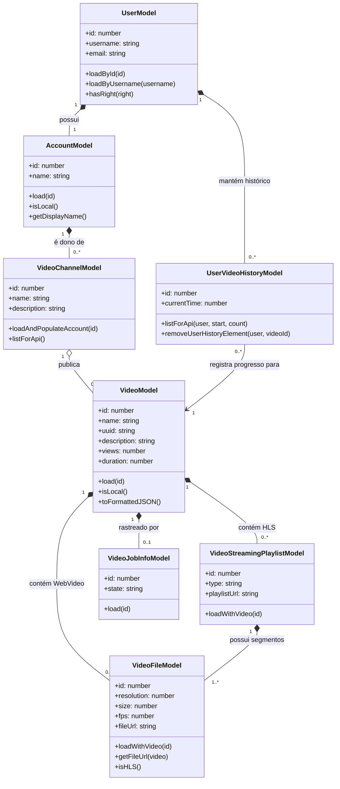

# Arquitetura VOD do PeerTube

Com base na engenharia reversa do diretório `server/core/models`, aqui está um diagrama de classes Mermaid com foco nas entidades envolvidas nos processos de **upload e visualização de Video on Demand (VOD)**.

## Principais Fluxos de Trabalho

### Upload de Vídeo
1. Um **Usuário** (autenticado via `UserModel`) seleciona um **Canal de Vídeo** (`VideoChannelModel`, de propriedade de seu `AccountModel`).
2. Um novo `VideoModel` é criado.
3. O processamento em segundo plano é rastreado via `VideoJobInfoModel`.
4. O servidor cria entradas diretas `VideoFileModel` (para arquivos WebVideo padrão) ou processa o vídeo em streams HLS, criando um `VideoStreamingPlaylistModel` que por sua vez contém múltiplos fragmentos `VideoFileModel` em diferentes resoluções.

### Visualização de Vídeo
1. O cliente solicita o vídeo e busca o `VideoFile` ou a `VideoStreamingPlaylist`.
2. À medida que o usuário assiste, o progresso é registrado em `UserVideoHistoryModel`.

## Descrições das Classes

### `UserModel`
| Membro | Tipo | Descrição |
|---|---|---|
| `+id` | Atributo | O identificador numérico único para o usuário no banco de dados. |
| `+username` | Atributo | O nome de usuário único usado para autenticação e identificação local. |
| `+email` | Atributo | O endereço de e-mail registrado do usuário. |
| `+loadById(id)` | Método | Recupera uma entidade de usuário do banco de dados pelo seu ID de chave primária. |
| `+loadByUsername(username)` | Método | Recupera uma entidade de usuário correspondente à string de nome de usuário fornecida. |
| `+hasRight(right)` | Método | Verifica se o usuário possui um direito de permissão específico (ex: privilégios de administrador). |

### `AccountModel`
| Membro | Tipo | Descrição |
|---|---|---|
| `+id` | Atributo | O identificador numérico único para a conta. |
| `+name` | Atributo | O nome voltado para o público da conta, frequentemente correspondendo ao nome de usuário ou um identificador federado. |
| `+load(id)` | Método | Recupera a conta pela sua chave primária. |
| `+isLocal()` | Método | Determina se a conta pertence a um usuário na instância local em vez de uma instância federada remota. |
| `+getDisplayName()` | Método | Retorna um nome de exibição formatado para a conta usado na interface do usuário (UI). |

### `VideoChannelModel`
| Membro | Tipo | Descrição |
|---|---|---|
| `+id` | Atributo | O identificador numérico único para o canal. |
| `+name` | Atributo | O nome identificador único do canal. |
| `+description` | Atributo | Uma descrição em texto fornecendo detalhes sobre o canal. |
| `+loadAndPopulateAccount(id)` | Método | Carrega o canal e realiza um SQL join para popular o seu `AccountModel` proprietário. |
| `+listForApi()` | Método | Recupera uma lista paginada de canais formatada para respostas da API. |

### `VideoModel`
| Membro | Tipo | Descrição |
|---|---|---|
| `+id` | Atributo | O identificador numérico único para o vídeo. |
| `+name` | Atributo | O título do vídeo. |
| `+uuid` | Atributo | Um identificador universalmente único usado para URLs públicas para evitar a exposição de IDs sequenciais. |
| `+description` | Atributo | O texto detalhado de descrição do vídeo. |
| `+views` | Atributo | A contagem acumulada de visualizações que o vídeo recebeu. |
| `+duration` | Atributo | A duração do vídeo em segundos. |
| `+load(id)` | Método | Carrega uma entidade de vídeo pelo seu ID primário. |
| `+isLocal()` | Método | Verifica se o vídeo está hospedado nesta instância ou é federado de outra. |
| `+toFormattedJSON()` | Método | Serializa o objeto de vídeo em uma representação JSON adequada para respostas da API. |

### `VideoFileModel`
| Membro | Tipo | Descrição |
|---|---|---|
| `+id` | Atributo | O identificador numérico único para o registro do arquivo. |
| `+resolution` | Atributo | A resolução vertical do arquivo de vídeo (ex: 720, 1080). |
| `+size` | Atributo | O tamanho do arquivo em bytes. |
| `+fps` | Atributo | Os quadros por segundo do arquivo de vídeo. |
| `+fileUrl` | Atributo | A URL direta ou caminho para o arquivo estático. |
| `+loadWithVideo(id)` | Método | Carrega o registro do arquivo junto com o seu `VideoModel` pai. |
| `+getFileUrl(video)` | Método | Calcula a URL absoluta para o arquivo baseada na configuração do servidor. |
| `+isHLS()` | Método | Determina se o arquivo faz parte de uma playlist de transmissão HLS (HTTP Live Streaming). |

### `VideoStreamingPlaylistModel`
| Membro | Tipo | Descrição |
|---|---|---|
| `+id` | Atributo | O identificador numérico único para a playlist. |
| `+type` | Atributo | O tipo de playlist (ex: HLS). |
| `+playlistUrl` | Atributo | O caminho de URL relativo para o arquivo de playlist `.m3u8`. |
| `+loadWithVideo(id)` | Método | Carrega a playlist junto com o `VideoModel` pai ao qual ela pertence. |

### `VideoJobInfoModel`
| Membro | Tipo | Descrição |
|---|---|---|
| `+id` | Atributo | O identificador numérico único para o registro de tarefa em segundo plano. |
| `+state` | Atributo | O estado atual da tarefa (ex: pending, active, completed, failed). |
| `+load(id)` | Método | Busca o registro de informações da tarefa pela sua chave primária. |

### `UserVideoHistoryModel`
| Membro | Tipo | Descrição |
|---|---|---|
| `+id` | Atributo | O identificador numérico único para a entrada de histórico. |
| `+currentTime` | Atributo | O timestamp em segundos indicando onde o usuário parou de assistir o vídeo pela última vez. |
| `+listForApi(user, start, count)` | Método | Retorna uma lista paginada dos vídeos assistidos anteriormente pelo usuário. |
| `+removeUserHistoryElement(user, videoId)` | Método | Deleta um vídeo específico do histórico de visualização do usuário. |

## Referência dos Arquivos Fonte

As informações usadas para construir este diagrama foram extraídas dos seguintes arquivos no repositório do PeerTube:

- [`UserModel`](file:///home/jaugusto/Projects/Arquitetura/PeerTube/server/core/models/user/user.ts)
- [`AccountModel`](file:///home/jaugusto/Projects/Arquitetura/PeerTube/server/core/models/account/account.ts)
- [`VideoChannelModel`](file:///home/jaugusto/Projects/Arquitetura/PeerTube/server/core/models/video/video-channel.ts)
- [`VideoModel`](file:///home/jaugusto/Projects/Arquitetura/PeerTube/server/core/models/video/video.ts)
- [`VideoFileModel`](file:///home/jaugusto/Projects/Arquitetura/PeerTube/server/core/models/video/video-file.ts)
- [`VideoStreamingPlaylistModel`](file:///home/jaugusto/Projects/Arquitetura/PeerTube/server/core/models/video/video-streaming-playlist.ts)
- [`VideoJobInfoModel`](file:///home/jaugusto/Projects/Arquitetura/PeerTube/server/core/models/video/video-job-info.ts)
- [`UserVideoHistoryModel`](file:///home/jaugusto/Projects/Arquitetura/PeerTube/server/core/models/user/user-video-history.ts)
